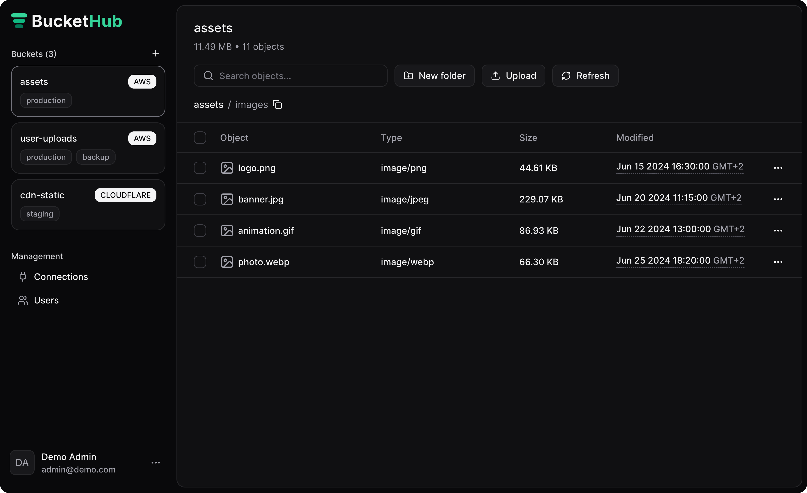

<p align="center">
  
</p>

<p align="center">
  Unified S3 bucket management platform. Connect, explore, and manage your cloud storage with ease.
</p>

<p align="center">
  <a href="LICENSE"></a>
  
  
  
  
</p>

<p align="center">
  <a href="https://demo.buckethub.net"><strong>Live Demo</strong></a>
</p>

<p align="center">
  
</p>

## About

BucketHub is a self-hostable, open-source platform for managing S3-compatible object storage. Browse, upload, organize, and share files across multiple providers from a single interface.

Supports **Amazon S3**, **Cloudflare R2**, **Backblaze B2**, **MinIO**, and any S3-compatible storage provider.

## Features

- **File browser** - Navigate buckets with drag-and-drop upload
- **Object operations** - Preview, download, copy, move, rename, delete, and share via presigned URLs
- **Multipart upload** - Handle large file uploads efficiently
- **Batch ZIP downloads** - Download multiple objects as a single ZIP archive
- **Bucket metrics** - View object count and total storage size
- **Connection management** - Store and manage multiple storage provider connections
- **User management** - Invite users and manage access with email-based invitations
- **Role-based permissions** - Granular bucket-level access control (view, edit, delete)
- **Tagging system** - Organize buckets with custom tags
- **Multi-provider support** - Connect to Amazon S3, Cloudflare R2, Backblaze B2, MinIO, or any S3-compatible service
- **Docker ready** - Single-container deployment
- **Kubernetes/Helm** - Deploy with the included Helm chart

## Self-Hosting

### Docker

```bash
docker run -d \
  --name buckethub \
  -p 3000:3000 \
  -v buckethub-data:/app/data \
  -e BASE_URL=http://localhost:3000 \
  -e ADMIN_NAME=Admin \
  -e ADMIN_EMAIL=admin@example.com \
  -e ADMIN_PASSWORD=changeme \
  -e SECRET_ENCRYPTION_KEY=<base64-encoded-32-byte-key> \
  -e AUTH_SECRET=<32-characters-secret> \
  ironbyte0x/buckethub
```

See the [Docker README](DOCKER_README.md) for full Docker and Docker Compose instructions.

### Kubernetes / Helm

A Helm chart is provided in the `charts/buckethub` directory.

```bash
helm install buckethub ./charts/buckethub \
  --set config.baseUrl="http://localhost:3000" \
  --set config.admin.name="Admin" \
  --set config.admin.email="admin@example.com" \
  --set secrets.adminPassword="<your-password>" \
  --set secrets.secretEncryptionKey="<base64-encoded-32-byte-key>" \
  --set secrets.authSecret="<32-characters-secret>" \
```

Then forward the port and open [localhost:3000](http://localhost:3000):

```bash
kubectl port-forward svc/buckethub 3000:80
```

To customize the deployment, copy the default values and edit as needed:

```bash
helm show values ./charts/buckethub > my-values.yaml
helm install buckethub ./charts/buckethub -f my-values.yaml
```

The chart supports configuring:

- **Ingress** - Enable and configure ingress with TLS
- **Persistence** - Persistent volume for the SQLite database
- **Resources** - CPU/memory requests and limits

### Environment Variables

| Variable                | Description                                                                                |
| ----------------------- | ------------------------------------------------------------------------------------------ |
| `DB_CONNECTION_STRING`  | SQLite database path (e.g. `data/db.sqlite`)                                               |
| `SECRET_ENCRYPTION_KEY` | Encryption key for stored credentials — generate with `openssl rand -base64 32`            |
| `AUTH_SECRET`           | Random string (min 32 chars) for session signing — generate with `openssl rand -base64 32` |
| `BASE_URL`              | Backend URL (default `http://localhost:3000`)                                              |
| `ADMIN_EMAIL`           | Initial admin account email                                                                |
| `ADMIN_PASSWORD`        | Initial admin account password                                                             |
| `ADMIN_NAME`            | Initial admin display name                                                                 |

## IAM Policy

Below is the IAM policy covering all BucketHub features:

```json
{
  "Version": "2012-10-17",
  "Statement": [
    {
      "Sid": "BucketHubAccess",
      "Effect": "Allow",
      "Action": [
        "s3:ListAllMyBuckets",
        "s3:ListBucket",
        "s3:PutObject",
        "s3:GetObject",
        "s3:DeleteObject",
        "s3:ListMultipartUploadParts",
        "s3:AbortMultipartUpload"
      ],
      "Resource": ["arn:aws:s3:::*/*", "arn:aws:s3:::*"]
    }
  ]
}
```

**Notes:**

- `s3:ListAllMyBuckets` is only required if you want buckets to be auto-discovered when adding a connection. Without it, you can still add buckets by entering the bucket name manually.
- `s3:PutObject`, `s3:DeleteObject`, `s3:ListMultipartUploadParts`, and `s3:AbortMultipartUpload` are only required if you want to perform mutations (upload, delete) from BucketHub. Omit these for read-only access.
- The `Resource` section can be scoped to a specific bucket (e.g. `arn:aws:s3:::my-bucket` and `arn:aws:s3:::my-bucket/*`) instead of granting access to all buckets.

## CORS Configuration

BucketHub uses presigned URLs to upload, download, and preview objects directly from the browser. Because these requests go straight to your S3 provider (not through the backend), you must configure CORS on each bucket to allow requests from the origin where BucketHub is hosted.

Example CORS configuration (adjust `AllowedOrigins` to match your deployment URL):

```json
[
  {
    "AllowedOrigins": ["https://your-buckethub-domain.com"],
    "AllowedMethods": ["GET", "PUT"],
    "AllowedHeaders": ["*"]
  }
]
```

**Provider-specific guides:**

- **Amazon S3** — [Adding a CORS configuration to a bucket](https://docs.aws.amazon.com/AmazonS3/latest/userguide/enabling-cors-examples.html)
- **Cloudflare R2** — [Configure CORS](https://developers.cloudflare.com/r2/buckets/cors/#add-cors-policies-from-the-dashboard)

## Development

### Prerequisites

- [Bun](https://bun.sh) (latest)

### Quick Setup

The setup script installs dependencies, generates secrets, creates `.env` files, and initializes the database:

```bash
git clone https://github.com/ironbyte0x/buckethub.git
cd buckethub
bun run setup.ts
```

### Manual Setup

1. **Install dependencies**

   ```bash
   git clone https://github.com/ironbyte0x/buckethub.git
   cd buckethub
   bun install
   ```

2. **Configure environment variables**

   ```bash
   cp apps/console/.env.example apps/console/.env
   cp apps/backend/.env.example apps/backend/.env
   ```

3. **Initialize the database**

   ```bash
   mkdir -p apps/backend/data
   cd apps/backend && bunx drizzle-kit migrate
   ```

### Running

```bash
# API server on :3000
bun nx serve backend

# Vite dev server
bun nx serve console
```

## Project Structure

```
apps/
  backend/       # Hono API server
  console/       # React frontend
  console-e2e/   # Playwright E2E tests
libs/
  rpc-contract/  # Shared type-safe API contract
  core/          # Shared types
  ui/            # Component library (Panda CSS)
  styled-system/ # Generated Panda CSS artifacts
```

## Contributing

Contributions are welcome. Please open an issue to discuss proposed changes before submitting a pull request. For bug reports, include steps to reproduce the issue.

## License

Licensed under the [MIT](LICENSE).
